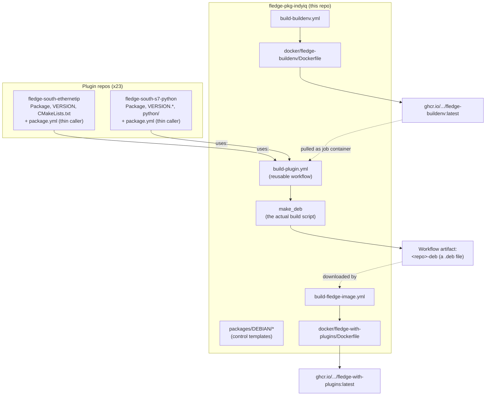

# How the GitHub Actions build system works

A ground-up explanation of the CI/CD setup for IndyIQ Fledge plugins: what
GitHub Actions concepts are in play, which workflow lives where, what each one
actually does, and how a C++ plugin and a Python plugin each flow through it.

Written assuming no prior Actions knowledge. If you already know Actions, skip
to [The four workflows](#the-four-workflows).

- Companion docs: [README.md](README.md) (30-second version),
  [cicd-workflow.md](cicd-workflow.md) (packaging-focused detail)
- This doc is **Actions-focused**: triggers, runners, tokens, artifacts, and how
  the repos call each other.

---

## 1. The big picture

There are four kinds of repo involved:

| Repo | Role |
|------|------|
| **`fledge-pkg-indyiq`** (this one) | Holds *all* the build logic: the `make_deb` script, the Debian control-file templates, the Docker build environment, and the reusable workflows. |
| **Plugin repos** (~23 of them: `fledge-south-ethernetip`, `fledge-south-s7-python`, `fledge-filter-*`, …) | Hold plugin source plus ~5 tiny metadata files and a ~15-line workflow that *calls* this repo. No build logic. |
| **`RobRaesemann/fledge`** | A fork of Fledge core. Its own workflow publishes the base runtime container image. |
| **GHCR** (`ghcr.io/robraesemann/…`) | GitHub's container registry. Stores the build-environment image and the finished runtime images. |

The core idea: **write the packaging logic once, here; every plugin repo just
declares metadata and says "build me."**



---

## 2. GitHub Actions concepts, mapped to this setup

If you're new to Actions, these are the only concepts you need. Each one is
followed by where it shows up here.

### Workflow
A YAML file in `.github/workflows/`. GitHub watches these files and runs them
when something triggers them. One file = one workflow.

*Here:* four workflow files total —
`.github/workflows/build-plugin.yml`, `build-buildenv.yml`,
`build-fledge-image.yml` in this repo, plus a `package.yml` in each plugin repo.

### Trigger (`on:`)
What causes the workflow to run. Common ones:
- `push:` — a commit or tag was pushed. Can filter by `branches:`, `tags:`, or
  `paths:` (only run if certain files changed).
- `schedule:` — cron, in UTC.
- `workflow_dispatch:` — a manual "Run workflow" button in the Actions tab (and
  `gh workflow run` from the CLI). Can declare `inputs:` that show up as form
  fields.
- `workflow_call:` — *this workflow is a library, callable by other workflows.*
  This is the one that makes the whole design work.

*Here:* plugin repos trigger on `push: tags: ['v*']` — i.e. **packaging happens
when you push a version tag**, not on every commit.

### Job
A named unit of work inside a workflow. Jobs run on a fresh virtual machine.
Jobs run in parallel by default unless you declare `needs:`.

*Here:* every workflow has exactly one job. No parallelism, no job dependencies.

### Runner
The VM the job runs on. `runs-on: ubuntu-latest` = a GitHub-hosted, clean
Ubuntu machine, destroyed when the job ends. Nothing persists between runs
except what you explicitly upload.

### Container (`container:`)
Optionally, instead of running steps directly on the runner VM, run them
*inside a Docker image*. The runner pulls the image and executes every step in
it. This is how C++ plugins get a consistent toolchain.

*Here:* `build-plugin.yml` conditionally runs its job inside
`ghcr.io/robraesemann/fledge-buildenv:latest`.

### Step
One command or one action inside a job. Steps share a filesystem and run in
order. Two flavours:
- `run:` — shell commands.
- `uses:` — invoke a prebuilt **action** (reusable step) from another repo,
  e.g. `actions/checkout@v5`, pinned to a version tag.

### Checkout
Actions do **not** automatically give you your source code. `actions/checkout`
clones it. By default it clones the repo the workflow belongs to; you can point
it at a different repo with `with: repository:`.

*Here:* `build-plugin.yml` checks out **this packaging repo**, not the plugin
repo. `make_deb` then clones the plugin repo itself. That's unusual but
deliberate — see [§4.2](#42-build-pluginyml--the-reusable-workflow-the-heart-of-it).

### `GITHUB_TOKEN`
Every workflow run is automatically issued a short-lived token, available as
`${{ secrets.GITHUB_TOKEN }}`. Key property: **it only has access to the repo
that triggered the run** (plus whatever `permissions:` you grant it). It cannot
read other private repos.

*Here:* this is why plugin builds work with no setup (the plugin repo's own
token clones the plugin repo), but the combined-image workflow needs a
hand-created PAT to reach 23 *other* private repos.

### `permissions:`
Narrows or widens what `GITHUB_TOKEN` can do. `contents: read` = read source.
`packages: write` = push container images to GHCR.

### Secrets
Encrypted values stored in repo/org settings, referenced as
`${{ secrets.NAME }}`. Never printed in logs (GitHub masks them).

*Here:* `ARTIFACT_PAT` — a classic personal access token with `repo` scope,
stored on this repo.

### Artifacts
Files uploaded from a run and attached to it, downloadable from the run's page
or via `gh run download`. **This is the only place finished `.deb` files
currently live.** Default retention is 90 days.

### Expressions `${{ … }}`
Inline template evaluation. `${{ github.ref_name }}` = the branch or tag being
built. `${{ inputs.x }}` = a workflow input. `${{ a && b || c }}` is the Actions
idiom for a ternary.

---

## 3. The reusable-workflow pattern (the key design choice)

A **reusable workflow** is a workflow with `on: workflow_call:`. Another
workflow calls it as if it were a function:

```yaml
jobs:
  package:
    uses: RobRaesemann/fledge-pkg-indyiq/.github/workflows/build-plugin.yml@main
    with:
      repo: fledge-south-ethernetip
```

Notes that matter:

- A **job**-level `uses:` (calling a whole workflow) is different from a
  **step**-level `uses:` (calling a single action). Here it's job-level: the
  called workflow supplies the entire job.
- `@main` pins which **ref** of the packaging repo the workflow YAML comes from.
  Change `build-plugin.yml` on `main` and every plugin repo picks it up on its
  next run — no PR to 23 repos. Powerful and slightly dangerous: a bad commit
  here breaks everyone.
- The called workflow's **caller repo context** applies: `secrets.GITHUB_TOKEN`
  inside `build-plugin.yml` is the *plugin repo's* token, scoped to the plugin
  repo. That's exactly what's needed for the clone.
- Called workflows can't see the caller's secrets unless explicitly passed
  (`secrets: inherit` or named). Not needed here — only the auto token is used.

The alternative would be copying `make_deb` and a full build workflow into 23
repos, then updating 23 repos every time the build changes. That's the problem
this pattern solves.

---

## 4. The four workflows

### 4.1 The plugin repo's `package.yml` — the thin caller

Lives in each plugin repo at `.github/workflows/package.yml`. Template:
[`examples/plugin-package.yml`](examples/plugin-package.yml).

`fledge-south-ethernetip/.github/workflows/package.yml` (C++):

```yaml
name: package

on:
  push:
    tags: ['v*']          # push a tag like v2.0.0 -> build
  workflow_dispatch:      # or click "Run workflow"

jobs:
  package:
    permissions:
      contents: read
    uses: RobRaesemann/fledge-pkg-indyiq/.github/workflows/build-plugin.yml@main
    with:
      repo: fledge-south-ethernetip
      branch: ${{ github.ref_name }}
      skip_requirements: true
```

`fledge-south-s7-python/.github/workflows/package.yml` (Python):

```yaml
on:
  push:
    branches: [indyiq/main]   # this one also builds on branch pushes
    tags: ['v*']
  workflow_dispatch:

jobs:
  package:
    permissions:
      contents: read
    uses: RobRaesemann/fledge-pkg-indyiq/.github/workflows/build-plugin.yml@main
    with:
      repo: fledge-south-s7-python
      branch: ${{ github.ref_name }}
      use_buildenv: false       # pure Python: no C++ toolchain needed
```

That's the entire per-plugin CI footprint. Two things vary between plugins:
`use_buildenv` and `skip_requirements`.

`branch: ${{ github.ref_name }}` matters: it's the branch **or tag name** that
triggered the run, and it's passed down so `make_deb` clones exactly that ref
back out of the plugin repo. (Yes — the workflow runs *from* the plugin repo,
then clones the plugin repo again. See below.)

The s7-python repo is a fork of an upstream Fledge plugin; its `develop`/
`master` branches mirror upstream, and all IndyIQ work (including this
workflow file) lives only on `indyiq/main`, so it triggers on pushes to that
branch too.

### 4.2 `build-plugin.yml` — the reusable workflow (the heart of it)

[`.github/workflows/build-plugin.yml`](.github/workflows/build-plugin.yml)

**Inputs it accepts:**

| Input | Default | Meaning |
|-------|---------|---------|
| `repo` | *(required)* | Plugin repository name |
| `branch` | `main` | Ref of the plugin repo to package |
| `org` | `RobRaesemann` | GitHub owner hosting the plugin repos |
| `pkg_ref` | `main` | Ref of **this** repo to take `make_deb` from |
| `image` | `ghcr.io/robraesemann/fledge-buildenv:latest` | Build environment image |
| `use_buildenv` | `true` | Run inside that image (needed for C++) |
| `skip_requirements` | `false` | Pass `-s` to `make_deb`, skipping the plugin's `requirements.sh` |

**The job:**

```yaml
jobs:
  package:
    runs-on: ubuntu-latest
    permissions:
      contents: read
    container: ${{ inputs.use_buildenv && inputs.image || '' }}
```

That `container:` line is the ternary idiom: if `use_buildenv` is true, run
every step inside the buildenv image; if false, the expression yields an empty
string, which Actions treats as "no container" — steps run directly on the
Ubuntu runner. One workflow, two execution environments.

**Step 1 — checkout the *packaging* repo:**

```yaml
- uses: actions/checkout@v5
  with:
    repository: RobRaesemann/fledge-pkg-indyiq
    ref: ${{ inputs.pkg_ref }}
```

This is the counterintuitive bit. The run was triggered by the *plugin* repo,
but the code checked out is *this* repo. The plugin source arrives later, via
`make_deb`'s own `git clone`. Reason: `make_deb` was designed to be able to
build several plugins in one invocation from arbitrary refs, so cloning is its
job, not the workflow's.

Note there are **two independent version knobs**: `@main` in the caller's
`uses:` decides which version of the *workflow YAML* runs, while `pkg_ref`
decides which version of *`make_deb` and the templates* gets checked out. They
default to the same thing but can disagree if you set `pkg_ref` explicitly.

**Step 2 — build:**

```yaml
- name: Build package
  env:
    GITHUB_TOKEN: ${{ secrets.GITHUB_TOKEN }}
  run: |
    chmod +x ./make_deb
    if [ "${{ inputs.skip_requirements }}" = "true" ]; then
      ./make_deb -s -o "${{ inputs.org }}" -b "${{ inputs.branch }}" "${{ inputs.repo }}"
    else
      ./make_deb -o "${{ inputs.org }}" -b "${{ inputs.branch }}" "${{ inputs.repo }}"
    fi
```

`GITHUB_TOKEN` is exported into the environment so `make_deb` can authenticate
its clone. Because a reusable workflow runs with the *caller's* token, and the
caller is the plugin repo, the token has exactly the read access needed — even
for a private plugin repo, with zero configuration. `make_deb` passes it as a
git `http.extraheader` rather than embedding it in the URL, so it can't leak
into error output.

**Step 3 — upload:**

```yaml
- uses: actions/upload-artifact@v6
  with:
    name: ${{ inputs.repo }}-deb
    path: packages/build/*.deb
    if-no-files-found: error
```

`if-no-files-found: error` makes a build that silently produced nothing fail
loudly instead of publishing an empty artifact.

The artifact is attached to the run in the **plugin repo** (Actions → the run →
Artifacts), not to this repo.

### 4.3 `build-buildenv.yml` — the C++ build environment image

[`.github/workflows/build-buildenv.yml`](.github/workflows/build-buildenv.yml)

```yaml
on:
  push:
    paths:
      - docker/fledge-buildenv/**
      - .github/workflows/build-buildenv.yml
  schedule:
    - cron: '0 6 * * 1'      # Mondays 06:00 UTC — pick up base-image security updates
  workflow_dispatch:
    inputs:
      fledge_branch: { default: v3.1.0 }

permissions:
  contents: read
  packages: write            # required to push to GHCR
```

The `paths:` filter means it only rebuilds when the Dockerfile (or the workflow
itself) changes — not on every commit to this repo.

Steps: checkout → compute a lowercased image name (GHCR rejects uppercase, and
the owner is `RobRaesemann`; `${GITHUB_REPOSITORY_OWNER,,}` is bash lowercasing)
→ set up Buildx → log into GHCR with `GITHUB_TOKEN` → `docker/build-push-action`
with registry-backed layer caching (`cache-from`/`cache-to` pointing at a
`:buildcache` tag).

What the image contains ([`docker/fledge-buildenv/Dockerfile`](docker/fledge-buildenv/Dockerfile)),
`FROM ubuntu:24.04`:
1. C++ toolchain: `build-essential`, `cmake`, `dpkg-dev`, `rapidjson-dev`, …
2. Fledge source cloned to `$FLEDGE_ROOT=/opt/fledge`, then Fledge's *own*
   `requirements.sh` run (so the dep list never drifts from upstream), then
   `make -j c_build` — a **full compile of Fledge's C libraries**. Plugins that
   link against `common-lib` etc. via `FindFledge.cmake` (e.g.
   `fledge-south-s2opcua`) find them prebuilt.
3. `libplctag` built and installed into `/usr/local`.

The whole point: that Fledge C build is expensive. Paying it once per *image*
build (weekly / on change) instead of once per *plugin* build is the difference
between a 2-minute and a 20-minute plugin CI run.

**Only this repo builds and pushes this image.** Plugin repos only pull it, and
the GHCR package is public — so no plugin repo needs `packages: write`, GHCR
credentials, or a per-repo access grant.

### 4.4 `build-fledge-image.yml` — assembling the deployable image

[`.github/workflows/build-fledge-image.yml`](.github/workflows/build-fledge-image.yml)

Manual only (`workflow_dispatch`), with a `base_image` input. This is the
workflow that turns 23 separate `.deb` artifacts into one runnable container.

**Step 1 — harvest artifacts from 23 other repos.** For each plugin repo:

```bash
run_id=$(gh run list --repo "RobRaesemann/${repo}" --workflow=package.yml \
          --status success --limit 1 --json databaseId --jq '.[0].databaseId')
gh run download "${run_id}" --repo "RobRaesemann/${repo}" --dir "/tmp/artifacts/${repo}"
```

It finds the most recent **successful** `package.yml` run in each plugin repo
and downloads its artifact. Then it copies every `.deb` into
`docker/fledge-with-plugins/debs/` and asserts the count equals the number of
repos — a cheap guard against a silently missing package.

**Why this needs `ARTIFACT_PAT` and not `GITHUB_TOKEN`:** the run's automatic
token is scoped to *this* repo only. Reading Actions artifacts from 23 other
(mostly private) repos is outside its reach. So a classic PAT with `repo` scope
is stored as the `ARTIFACT_PAT` secret and exported as `GH_TOKEN` for the `gh`
CLI. This is the one place in the system that needs manual credential
maintenance — if image builds start failing with 404s on plugin repos, check
whether that PAT expired.

**Step 2 — build the image** from
[`docker/fledge-with-plugins/Dockerfile`](docker/fledge-with-plugins/Dockerfile),
based on `ghcr.io/robraesemann/fledge:indyiq-main` (published by the
`RobRaesemann/fledge` fork's own `docker-publish.yml`, which fires on pushes to
its `indyiq/main` branch).

The interesting trick inside that Dockerfile: every plugin `.deb` declares
`Depends: fledge (>= 3.1)`, but the base image builds Fledge from source with
`make install` — dpkg has no `fledge` package registered, so the dependency
can't be satisfied. Rather than `--force-depends` (which would also mask
genuinely missing libraries), it uses `equivs` to register a placeholder
`fledge` package at the real running version, then installs the plugins with
`apt-get install ./*.deb` so real distro dependencies (e.g. `libfftw3` for
`fledge-filter-fft`) still resolve normally.

Published to `ghcr.io/robraesemann/fledge-with-plugins:latest` and
`:run-<run_id>`.

---

## 5. What actually runs inside the job: `make_deb`

The workflow is thin; `make_deb` does the work. Summary of its `build_one()`:

1. **Clone** (clone mode) or use the working tree in place (`-l`, local mode for
   dev).
2. **Read metadata** — requires `Package` and `Description`; `source`s `Package`
   as shell to pick up `plugin_name`, `plugin_type`, `plugin_install_dirname`,
   `plugin_package_name`, and optionally `plugin_lang`, `requirements`,
   `additional_libs`, `plugin_build_target`. (`Package` files can branch on
   `$arch`/`$package_manager`, which `make_deb` sets before sourcing.)
3. **Resolve version** — `VERSION.<type>.<name>` (either a bare version or a
   `<name>_version=X` line) preferred, else a bare `VERSION`. The Fledge
   dependency comes from `fledge.version`, else a `fledge_version` line in the
   `VERSION.<type>.<name>` file. Both are mandatory; missing either is a hard
   error.
4. **Resolve language** — `plugin_lang` if set, else auto-detect: a `python/`
   dir ⇒ Python, a `CMakeLists.txt` ⇒ C++. Python packages get
   `Architecture: all`; C++ gets the runner's real architecture.
5. **Stage** into `packages/build/<name>_<version>_<arch>/`: copy the central
   `DEBIAN/{control,postinst,postrm}` templates and `sed`-fill the `__VERSION__`,
   `__NAME__`, `__ARCH__`, `__REQUIRES__`, `__DESCRIPTION__`, `__INSTALL_DIR__`,
   `__PLUGIN_NAME__`, `__PLUGIN_TYPE__`, `__PLUGIN_NOTES__` placeholders.
   - Python: copy `python/fledge/plugins/<type>/<name>/` verbatim, strip
     `__pycache__`/`*.pyc`, stamp `__version__`, and bundle
     `requirements.txt` or `python/requirements-<name>.txt` into the payload.
   - C++: run `requirements.sh` (unless `-s`), `cmake` + build (only
     `plugin_build_target` if declared, so test binaries are skipped), copy
     `build/lib*.so*`.
   - `additional_libs`: bundle arbitrary extra files (e.g. libplctag) at
     arbitrary paths.
6. **`dpkg-deb --root-owner-group --build`**, then copy the `.deb` back to this
   repo's `packages/build/` so the workflow's `upload-artifact` glob finds it.

At install time on a device, the templated `postinst` chowns the install dir,
runs `ldconfig` (so bundled `.so`s are found), pip-installs the bundled
`requirements.txt` if present (with `--break-system-packages`, required by
PEP 668 on Python 3.11+), and runs an optional `extras_install.sh` the plugin
may ship. `postrm` deletes the install dir on remove/purge.

> Note: `README.md` and `cicd-workflow.md` still describe pip installs as
> happening via `extras_install.sh`. As of commit `61476fd`, `postinst` installs
> `requirements.txt` directly; `extras_install.sh` is now just an optional extra
> hook.

---

## 6. Worked example: C++ plugin — `fledge-south-ethernetip`

**Files in the plugin repo:**

```
Package             plugin_lang=cpp, plugin_build_target=ethernetip,
                    additional_libs=usr/local/fledge/lib:/usr/local/lib/libplctag.so.2.6.15:…
Description         one-line package description
VERSION             2.0.0
fledge.version      fledge_version>=3.1
requirements.sh     builds libplctag 2.6.15 from source
CMakeLists.txt      builds the `ethernetip` target against $FLEDGE_ROOT
plugin.cpp, plctag.cpp, include/, tests/
.github/workflows/package.yml    (15 lines, shown in §4.1)
```

**End-to-end trace of `git push origin v2.0.0`:**

1. GitHub sees a tag matching `v*` → starts `package.yml` in the plugin repo.
2. That job is a `uses:` of `build-plugin.yml@main` in this repo, with
   `repo: fledge-south-ethernetip`, `branch: v2.0.0`, `skip_requirements: true`.
   `use_buildenv` is left at its `true` default.
3. Actions allocates an `ubuntu-latest` runner, pulls
   `ghcr.io/robraesemann/fledge-buildenv:latest`, and runs every step inside it.
   `$FLEDGE_ROOT=/opt/fledge` with Fledge's C libs already compiled; libplctag
   already in `/usr/local`.
4. `actions/checkout@v5` clones `fledge-pkg-indyiq@main` into the workspace.
5. `./make_deb -s -o RobRaesemann -b v2.0.0 fledge-south-ethernetip` runs.
   `-s` skips `requirements.sh` — libplctag is already in the image, so
   rebuilding it would waste several minutes every run.
6. `make_deb` clones the plugin repo at tag `v2.0.0` (authenticated via
   `GITHUB_TOKEN`), reads `Package`, sees `plugin_lang=cpp`, runs
   `cmake -DFLEDGE_ROOT=/opt/fledge -DBUILD_TESTS=OFF ..` and
   `cmake --build . --target ethernetip`.
7. `libethernetip.so` → `/usr/local/fledge/plugins/south/ethernetip/`;
   the three libplctag `.so` symlinks/files → `/usr/local/fledge/lib/`
   (via `additional_libs`, preserving symlinks).
8. `dpkg-deb` produces `fledge-south-ethernetip_2.0.0_x86_64.deb`.
9. Uploaded as artifact `fledge-south-ethernetip-deb` on that run.

**Why `skip_requirements: true` is safe here and not in general:** this plugin's
only native build dep is libplctag, which is baked into the image. A C++ plugin
with deps *not* in the image must leave `skip_requirements` at `false` so its
own `requirements.sh` runs.

---

## 7. Worked example: Python plugin — `fledge-south-s7-python`

**Files in the plugin repo:**

```
Package                        plugin_name=s7_python, plugin_type=south,
                               plugin_package_name=fledge-south-s7-python
                               (note: no plugin_lang — auto-detected)
Description
VERSION.south.s7_python        fledge_south_s7_python_version=3.1.0
                               fledge_version>=3.1
python/fledge/plugins/south/s7_python/{__init__.py,s7_python.py}
python/requirements-s7_python.txt
requirements.sh                (legacy upstream file — NOT run for Python plugins)
.github/workflows/package.yml  use_buildenv: false
```

**End-to-end trace of a push to `indyiq/main`:**

1. `package.yml` triggers (this repo builds on branch pushes *and* `v*` tags).
2. It calls `build-plugin.yml@main` with `use_buildenv: false`.
3. `container:` evaluates to `''` → steps run directly on the bare
   `ubuntu-latest` runner. No image pull, no C++ toolchain — much faster.
4. Checkout of `fledge-pkg-indyiq@main`, then
   `./make_deb -o RobRaesemann -b indyiq/main fledge-south-s7-python`.
5. `make_deb` clones the plugin, sources `Package`, finds **no `plugin_lang`**,
   and auto-detects Python from the presence of `python/`.
6. Version comes from `VERSION.south.s7_python` — the fledge-pkg style
   `<name>_version=` line gives `3.1.0`; the `fledge_version>=3.1` line in the
   same file supplies the Fledge dependency (there's no separate
   `fledge.version` file here).
7. `Architecture: all` (pure Python is arch-independent), so the package is
   `fledge-south-s7-python_3.1.0_all.deb`.
8. `python/fledge/plugins/south/s7_python/` copied verbatim to
   `/usr/local/fledge/python/fledge/plugins/south/s7_python/`, bytecode
   stripped, `__version__` stamped, and `python/requirements-s7_python.txt`
   bundled as `requirements.txt` in the payload for `postinst` to pip-install
   on the target device.
9. Uploaded as artifact `fledge-south-s7-python-deb`.

**Key contrasts with the C++ path:** no container, no `cmake`, no
`requirements.sh` (that file exists only because the repo is a fork of an
upstream plugin — `make_deb` only runs `requirements.sh` for C++ plugins),
`Architecture: all`, and runtime deps deferred to pip at install time rather
than compiled in.

---

## 8. Tokens and permissions, in one table

| Workflow | Token | Why |
|----------|-------|-----|
| Plugin `package.yml` → `build-plugin.yml` | Auto `GITHUB_TOKEN`, `contents: read` | Runs with the *caller's* token; only needs to read the plugin repo that triggered it. Zero setup, works for private repos. |
| `build-buildenv.yml` | Auto `GITHUB_TOKEN`, `packages: write` | Pushes the image to GHCR under the same owner. |
| `build-fledge-image.yml` | **`ARTIFACT_PAT`** (classic PAT, `repo` scope) + auto token for GHCR push | The auto token can't read artifacts in 23 *other* private repos. The only manually-maintained credential in the system. |

Consequence worth internalising: **the reason plugin repos need no secrets at
all** is that reusable workflows inherit the caller's identity, and the caller
is always the repo being built.

---

## 9. Running and debugging things

```bash
# Trigger a plugin build manually (from inside the plugin repo)
gh workflow run package.yml

# Or by pushing a release tag
git tag v2.0.1 && git push origin v2.0.1

# Watch it
gh run watch
gh run list --workflow=package.yml

# Get the .deb
gh run download <run-id>                 # latest artifact from that run

# Rebuild the C++ build environment image (from this repo)
gh workflow run build-buildenv.yml -f fledge_branch=v3.1.0

# Assemble the combined runtime image (from this repo)
gh workflow run build-fledge-image.yml
```

**Reproduce a CI build locally.** The most valuable debugging move — the same
`make_deb` in the same image is exactly what CI runs:

```bash
# Python plugin (bare, matches use_buildenv:false)
./make_deb -l /home/rob/github/fledge-iot/fledge-south-s7-python

# C++ plugin, in the real build environment
docker run --rm -v "$PWD:/work" -v /home/rob/github/fledge-iot:/src \
  ghcr.io/robraesemann/fledge-buildenv:latest \
  ./make_deb -s -l /src/fledge-south-ethernetip
```

`-l` (local mode) packages the working tree in place, honouring uncommitted
edits — CI always uses clone mode instead.

---

## 10. Gotchas and things worth knowing

- **`@main` is unpinned.** Every plugin repo tracks `build-plugin.yml@main`.
  A breaking change here breaks all 23 immediately. If that ever becomes a
  problem, tag this repo and have plugins reference `@v1`.
- **Builds only happen on tags** (except s7-python, which also builds on
  `indyiq/main` pushes). Merging to `main` in a plugin repo produces nothing.
- **Artifacts expire.** Default 90-day retention. If a plugin hasn't been
  rebuilt in over 90 days, `build-fledge-image.yml` will fail to download it —
  the fix is to re-run that plugin's `package.yml`.
- **`build-fledge-image.yml` picks the latest successful run on *any* branch.**
  `gh run list --workflow=package.yml --status success --limit 1` isn't
  branch-filtered, so a successful build from an experimental branch can be
  what lands in the combined image.
- **The `.deb` count check is an equality test**, so one repo producing two
  `.deb`s could mask another producing none. It's a smoke test, not a proof.
- **Container mode changes the filesystem**, not just the tools. Paths inside
  the job are inside the image (`$FLEDGE_ROOT=/opt/fledge`). If a build works
  locally but not in CI, check whether you're comparing container to bare
  runner.
- **`skip_requirements: true` is per-plugin and unsafe by default.** Only set it
  when every native dep is already in `fledge-buildenv`.
- **No publishing step exists yet.** Nothing signs the packages, uploads them to
  an APT repo, or attaches them to a GitHub Release. The `.deb` lives as an
  Actions artifact and gets consumed by the container build. (There's a separate
  `fledge-apt-repo` repo in the org, not yet wired in.)

---

## 11. Onboarding a new plugin

1. Add the metadata files, copied from a sibling plugin of the same language:
   `Package`, `Description`, `VERSION` (or `VERSION.<type>.<name>`),
   `fledge.version`.
2. C++: make sure `CMakeLists.txt` builds a plugin target; set
   `plugin_build_target` in `Package` to avoid building test binaries; add a
   `requirements.sh` for any build dep not already in `fledge-buildenv`.
   Python: put source at `python/fledge/plugins/<type>/<name>/` and pip deps in
   `requirements.txt` or `python/requirements-<name>.txt`.
3. Verify locally first: `./make_deb -l /path/to/plugin` (or inside the buildenv
   image for C++). Faster than debugging through CI.
4. Copy [`examples/plugin-package.yml`](examples/plugin-package.yml) to
   `.github/workflows/package.yml`, set `repo:`, and add `use_buildenv: false`
   if it's pure Python.
5. Push a `v*` tag or run the workflow manually; confirm the `<repo>-deb`
   artifact appears on the run.
6. If it should ship in the combined image, add the repo name to the `repos=(…)`
   array in `build-fledge-image.yml` in this repo.
